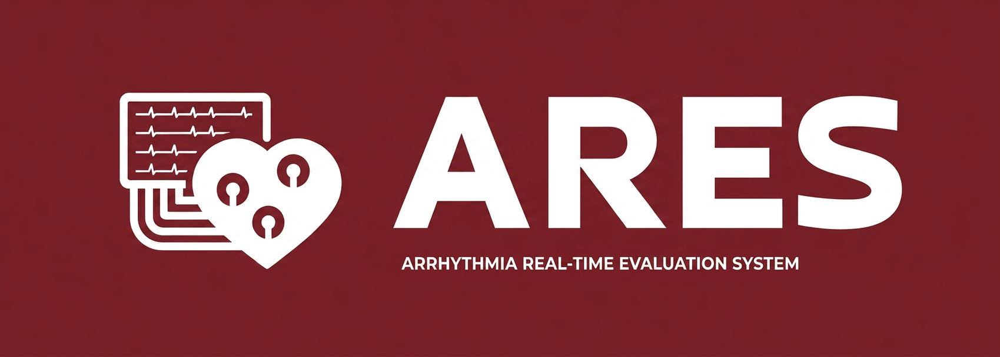

 
 

## 📖 Documentación del Proyecto

Toda la documentación técnica y de seguimiento del sistema se encuentra centralizada en el directorio `/docs`.

* **Carpeta de Campo (`/docs/carpeta_de_campo/`):** Contiene el registro iterativo del proyecto en formato `.pdf`. Documenta detalladamente el progreso semanal, las decisiones tomadas y el aporte técnico individual de cada integrante a lo largo del ciclo de desarrollo anual.
  

&nbsp;

## 🛠 Componentes Utilizados

* **Microcontrolador (ESP32-S3):** 
  * Ejecuta el firmware principal. Mantiene la transmisión de datos sin pérdida de paquetes bajo conexión Wi-Fi estable. Actualmente falta optimizar el modo Deep Sleep para mejorar la eficiencia energética.

* **Filtro Analógico / Sensor ECG (AD8232):** 
  * El acondicionamiento de la señal base es correcto, pero se requiere ajustar los filtros pasivos por hardware para reducir el ruido inducido por el movimiento del usuario.

* **Conversor Analógico-Digital (ADS1115):** 
  * Resuelve la falta de linealidad del ADC interno del ESP32. Aporta conversión de 16 bits, garantizando la resolución necesaria para interpretar la señal cardíaca del AD8232 sin distorsiones digitales.

* **Módulo de Carga (TP4056):** 
  * Gestiona la carga y protección de la batería de litio, asegurando la alimentación autónoma y segura del circuito completo.

> **Nota:** Las imágenes y descripciones detalladas de cada elemento se encuentran en el directorio `/hardware/componentes/`. Las hojas de datos de referencia se ubican en `/hardware/datasheets/`.

&nbsp;

## 🌟 Sobre el Proyecto

ARES (Arrhythmia Real-time Evaluation System) es un sistema portátil de monitoreo electrocardiográfico continuo. Consiste en un circuito impreso (PCB) con componentes SMD, basado en un microcontrolador ESP32 y un módulo analógico AD8232, completamente integrado en un top deportivo. 

El objetivo es capturar, filtrar y transmitir la actividad eléctrica del corazón en tiempo real hacia una plataforma web, permitiendo la detección temprana de anomalías cardíacas.

 
  

## 🎯 Características

- **Captura Biométrica:** Lectura de señal ECG de un canal mediante el front-end AD8232.
- **Factor de Forma Ergonómico:** Hardware miniaturizado con componentes SMD para no interferir con la actividad física.
- **Conectividad:** Transmisión inalámbrica de la telemetría utilizando la pila Wi-Fi/BLE del ESP32.
- **Visualización Remota:** Interfaz gráfica web para el monitoreo en tiempo real por parte del usuario o personal médico.
- **Wearable Integrado:** Diseñado específicamente para funcionar dentro de la estructura de una prenda deportiva.

&nbsp;

## 🤝 Contacto

Para desarrollo, auditoría de hardware o consultas de inversión:

Mail - proyectoares26@gmail.com

Link del Proyecto: [https://github.com/impatrq/ARES](https://github.com/impatrq/ARES)